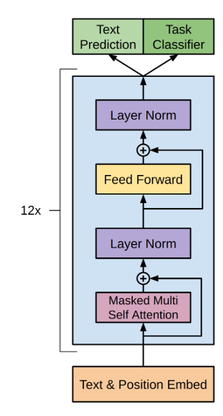
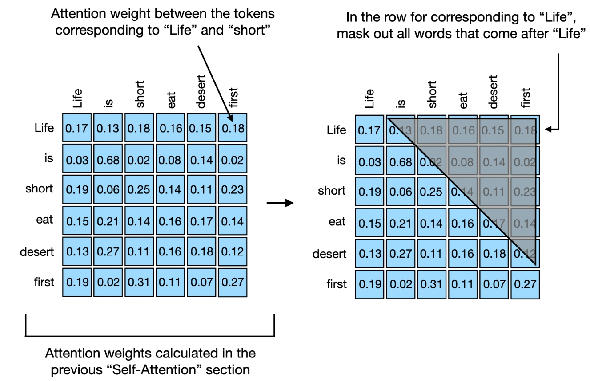
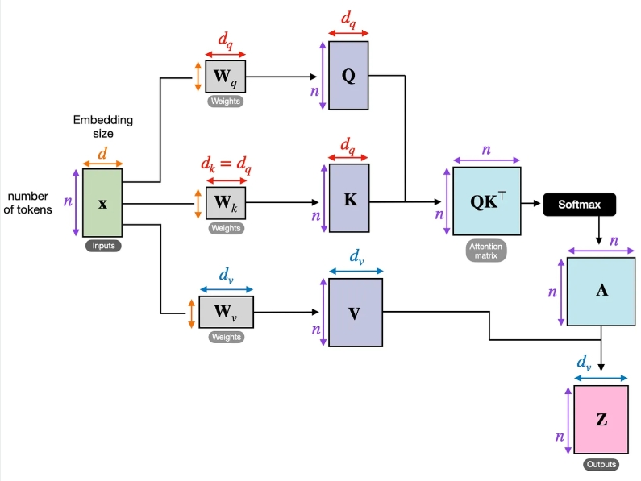
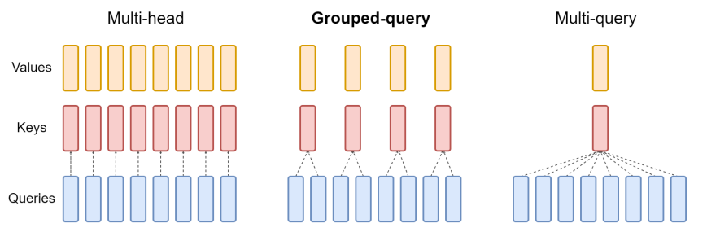

# Transformer/Attention技术分享

## 目录

1. 什么是Transformer
2. Transformer的结构
3. Transformer/Attention的训练加速
4. Transformer/Attention的推理加速
5. 参考资料

## 1. 什么是Transformer

Transformer是一种基于自注意力（Self-Attention）机制的深度学习模型，广泛用于自然语言处理（NLP）和计算机视觉（CV）等任务。相较于传统的RNN和CNN，Transformer能够更高效地建模长距离依赖关系，并具有更好的并行化能力。

### 1.1 输入与输出
Transformer的输入通常是一个 **Token 序列**，每个Token是一个整数索引，对应词汇表（Vocabulary）中的某个单词或子词。
- **输入形状**：$(b, n)$，其中 $b$ 是批量大小（Batch Size），$n$ 是序列长度（Sequence Length）。
- **嵌入后形状**：$(b, n, d)$，其中 $d$ 是隐藏层维度（Hidden Dimension）。
- **输出形状**：$(b, n, v)$，其中 $v$ 是词汇表大小（Vocabulary Size），用于预测下一个Token的概率。

## 2. Transformer结构




### 2.1 经典Transformer架构
Transformer的基本结构由多个自注意力（Self-Attention）和前馈神经网络（Feedforward Network, FFN）层堆叠而成，典型的GPT架构包括：
- **Token Embedding**：将离散的文本Token映射到高维连续向量。
    - $\mathbf{O} = \text{Embedding}(\mathbf{X})$；
- **位置编码（Positional Encoding）**：因为自注意力本身不包含位置信息，因此需要额外编码位置。
    - $\mathbf{O} = \text{PositionalEncoding}(\mathbf{X})$；
- **自注意力层（Self-Attention, Token-Mixing）**：计算Token之间的相关性。
    - $\mathbf{Q}^{(i)} = \mathbf{X} \mathbf W_q^{(i)}$；
    - $\mathbf{K}^{(i)} = \mathbf{X} \mathbf W_k^{(i)}$；
    - $\mathbf{V}^{(i)} = \mathbf{X} \mathbf W_v^{(i)}$；
    - $\mathbf{O}^{(i)} = \text{Attention}(\mathbf{Q}^{(i)}, \mathbf{K}^{(i)}, \mathbf{V}^{(i)})= \text{softmax} \left({\mathbf{Q}^{(i)} {\mathbf{K}^{(i)}}^\top}/{\sqrt{d_h}} \right) \mathbf{V}^{(i)}$；
    - $\mathbf{O} = \mathrm{concat}(\mathbf{O}^{(1)},  \ldots, \mathbf{O}^{(h)}) \mathbf W_o$；
- **前馈网络（FFN, Channel-Mixing）**：计算Channel之间的相关性。
    - $\mathbf{O} = g(\mathbf X \mathbf W_1) \mathbf W_2$；
- **残差连接（Residual Connection）和层归一化（LayerNorm）**：
    - $\mathbf{O} = \text{LayerNorm}(f(\mathbf X) + \mathbf{X})$；
- **输出投影**：将隐藏状态映射回词汇表，计算生成的下一个Token概率分布。
    - $\mathbf{O} = \mathbf{O} \mathbf W_v$；


### 2.3 Llama架构
Llama是Meta推出的优化版Transformer，相比GPT，Llama具有以下优化：
- **Pre-Normalization**：LayerNorm在每个子层（Attention/FFN）之前，而不是之后，提高稳定性。
    - $\mathbf{O} = f(\text{LayerNorm}(\mathbf X)) + \mathbf{X}$；
- **旋转位置编码（RoPE）**：
    - $\mathbf Q^{(i)}_s = \mathbf Q^{(i)}_s \mathbf W_q$；
    - $\mathbf K^{(i)}_s = \mathbf K^{(i)}_s \mathbf W_k$；
    - $ \mathbf Q^{(i)}_s \mathbf W_s (\mathbf K^{(i)}_t \mathbf W_t) ^\top = \mathbf Q^{(i)}_s \mathbf W_{s-t} {\mathbf K^{(i)}_t } ^\top$；
    - 内积计算时增加了相对位置信息；
- **GLU**：替代FFN，提高表达能力，公式如下：
  $$
  \text{GLU}(\mathbf X) = [(\mathbf X \mathbf W_1) \odot \sigma(\mathbf X \mathbf W_2)] \mathbf W_3.
  $$

### 2.4 Causal vs. Non-Causal Attention



## 3. Transformer/Attention的训练加速

### 3.1 标准Attention的计算复杂度
传统的自注意力计算公式如下：
$$
\text{Attention}(\mathbf Q, \mathbf K, \mathbf V) = \text{softmax} \left( \frac{\mathbf Q \mathbf K^\top}{\sqrt{d_h}} \right) \mathbf V
$$

#### 计算复杂度分析
- **时间复杂度**：$O(n^2 d_h)$，因为 $QK^T$ 计算需要 $(b, n, h, d_h) \times (b, n, h, d_h)$。
    - 对于矩阵$\mathbf A\in \mathbb R^{n\times k}, \mathbf B\in \mathbb R^{k\times m}$，$\mathbf C= \mathbf A \mathbf B$的计算复杂度为$O(nmk)$：$\mathbf C_{i,j} = \sum_{l=1}^k \mathbf A_{i,l} \mathbf B_{l,j}$。
- **空间复杂度**：$O(n^2)$，存储完整的注意力权重矩阵。



### 3.2 Flash Attention
Flash Attention通过Tiling以及online softmax，减少了显存占用，提升了计算速度。

#### 3.2.1 Tiling
Tiling将输入矩阵分成小块，减少显存占用：
$$
\begin{aligned}
\mathbf A &= \mathrm{softmax}(\mathbf Q \mathbf K^\top), \\
\mathbf O_i &= \sum_j \mathbf A_{i,j} \mathbf V_j.
\end{aligned}
$$
我们可以每次计算$\mathbf A_{i,j} \mathbf V_j$，然后累加到$\mathbf O_i$，从而减少显存占用。但是这里遗留了一个问题，计算需要用到$\mathbf A_{i,j}$，但由于`softmax`激活函数需要计算所有位置的注意力权重，在第$j$次计算时，$\mathbf A_{i,j}$是未知的。

#### 3.2.2 Online Softmax
注意到标准softmax的计算公式为：
$$
\text{softmax}(x_i) = \frac{e^{x_i}}{\sum_{j=1}^n e^{x_j}}
$$
online softmax的思路是，我们不必一次性计算所有位置的权重，而是通过迭代结算，每次计算一个位置的权重，然后通过rescale，从而得到最终的结果：
$$
\begin{aligned}
\frac{\exp(x_1)}{\exp(x_1) + \exp(x_2) + \exp(x_3) } 
& = 
\frac{\exp(x_1) + \exp(x_2) }{\exp(x_1) + \exp(x_2) + \exp(x_3) } \frac{\exp(x_1)}{\exp(x_1) + \exp(x_2) } \\
&= \frac{m_2}{m_3}\times  \frac{s_1}{m_2}.
\end{aligned}
$$
通过online softmax, 我们可以得到如下递推式：
$$
\begin{aligned}
\mathbf O_i^k &= \frac{m_{i, k-1}}{m_{i, k}} \mathbf O_i^{k-1} + \frac{s_{i,k}}{m_{i, k}} \mathbf V_k, \\
s_{i,k} &= \exp(\mathbf Q_i \mathbf K_k^\top), \\
m_{i,k} &= m_{i, k-1} + s_{i,k}.
\end{aligned}
$$

## 4. Transformer的推理

这里的推理特指语言模型的推理，即给定一个输入序列，预测下一个Token：
```
Input: x1, ... , xn
Output: xn+1
```

### 4.1 朴素推理（无KV Cache）
每个时间步重新计算整个输入的注意力，即：
$$
\mathbf{O} = \mathrm{Transformer}(\mathbf{X}).
$$
因为是预测下一个Token，所以只需要拿到最后一个Token的输出，即：
$$
\mathbf{O}_{n} = \mathrm{Transformer}(\mathbf{X})_n.
$$
因为每次都需要调用Transformer，所以复杂度为 $O(n^2 d)$，此时只需要缓存输入Token id，显存占用为 $O(n)$。

### 4.2 KV Cache
注意到我们每次只需要最后一个位置的输出，而Attention的计算公式为：
$$
\mathbf o_i = \sum_{j=1}^i \frac{\exp(\mathbf q_i \mathbf k_j^\top)}{\sum_{j=1}^i \exp(\mathbf q_i \mathbf k_j^\top)} \mathbf v_j, \\
\mathbf o_{i+1} = \sum_{j=1}    ^i \frac{\exp(\mathbf q_i \mathbf k_j^\top)}{\sum_{j=1}^i \exp(\mathbf q_i \mathbf k_j^\top)} \mathbf v_j.
$$
对于$\mathbf o_{i+1}$，因为$\mathbf k_j, \mathbf v_j, j\le i$已经在上次计算$\mathbf o_i$时计算过，所以如果我们缓存$\mathbf k_j, \mathbf v_j, j\le i$，那么我们只需要计算$\mathbf q_{i+1}, \mathbf k_{i+1}, \mathbf v_{i+1}$，然后计算$\mathbf o_{i+1}$，此时计算复杂度为$O(n d)$，显存占用为$O(Lnd_h \times h)$，其中$L$是Transformer的层数。

$\mathbf k_j, \mathbf v_j, j\le i$就叫做kv-cache。

### 4.3 MQA 和 GQA
在Transformer推理时，瓶颈主要是传输kv-cache，所以一个优化方向是减少kv-cache的大小，从kv-cache的显存为$O(Lnd_h \times h)$，比较常用的方案就是降低$h$，此时对应MQA和GQA：

- **MQA（Multi-Query Attention）**：多个查询共享一个键值对，提高缓存效率。
- **GQA（Grouped-Query Attention）**：将查询分成多个组，每组共享键值。



## 5. 参考资料
1. https://zhuanlan.zhihu.com/p/626079753
2. https://zhuanlan.zhihu.com/p/676655352
3. https://magazine.sebastianraschka.com/p/understanding-and-coding-self-attention
4. https://arxiv.org/pdf/2305.13245